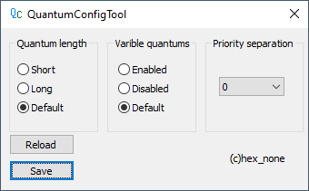

# QuantumConfigTool

Simple windows quantum configuration utility.
This is the more flexible GUI alternative for Perfomance Options quantum configuration dialog box.

You can set the exact _KPROCESS QuantumReset value according to the table:

<table>
  <tr>
    <td></td>
    <td colspan="3">Short Quantum Index</td>
	<td colspan="3">Long Quantum Index</td>
  </tr>
  <tr>
    <td>Varible</td>
    <td>6</td>
    <td>12</td>
    <td>18</td>
    <td>12</td> 
    <td>24</td> 
    <td>36</td>
  </tr>
    <tr>
        <td>Fixed</td>
        <td>18</td>
        <td>18</td>
        <td>18</td>
        <td>36</td> 
        <td>36</td> 
        <td>36</td>
    </tr>
</table>

------

**System Requirements**

* Windows 2000 - 10 x86/x86_64
* Account with administrative rights

**How does it work?**

It simply changes the HKLM\SYSTEM\CurrentControlSet\Control\PriorityControlWin32PrioritySeparation registry value.
